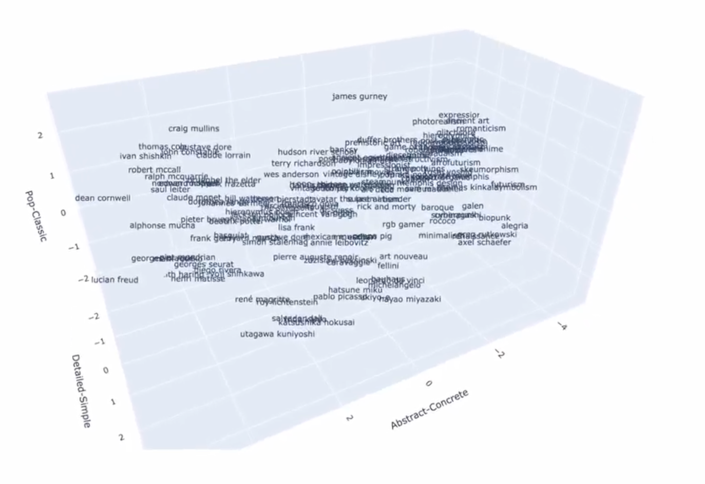

# ClipAnalysis

Shows the relation of Concepts in the Clipspace

Tried to visualize CLIP (by OpenAI) in a 3D space cloud via Python. A list of different embeddings of different concepts (here: Artists) is used to show the connections. Still has to be improved, because it boils 512 dimension down to three, so there is a lot of room for interpretation.
